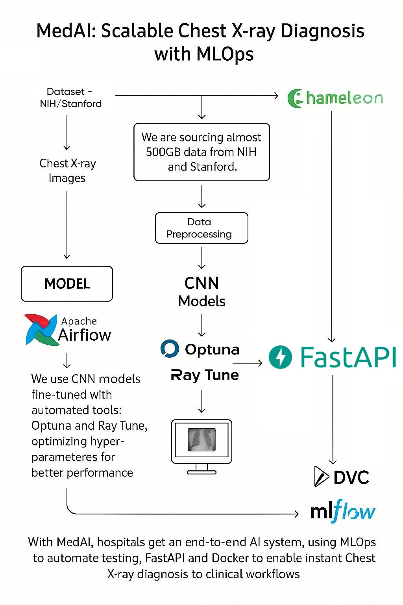

**Title of Project:
[MedAI-Scalable-Diagnosis-with-Machine-Learning](https://github.com/Shrey12202/MedAI-Scalable-Diagnosis-with-Machine-Learning)**

**Value Proposition**

**Context of Use**

Our project aims to develop an AI-powered diagnostic tool that
integrates seamlessly into existing medical workflows, particularly for
**chest X-ray analysis** in hospitals and clinics. Contemporary
diagnostic methods depend chiefly on the manual interpretation by
radiologists, which can be time-consuming, subject to human error, and
limited by cognitive fatigue, particularly during periods of heavy
workload. Unlike standalone AI-based diagnostic platforms, our system
augments current radiological assessments by offering automated,
**quick, and accurate detection** of diseases such as **pneumonia,
tuberculosis, lung opacities, cardiomegaly, and pleural effusions**. By
reducing diagnostic bottlenecks and assisting radiologists with
AI-driven insights, our solution enhances early disease detection,
improving patient care.

When a chest X-ray is being taken, images are automatically passed
through MedAI\'s diagnostic pipeline. Within seconds, the AI-generated
report of identified abnormalities and predicted diseases is integrated
into the PACS interface, neatly labeled and visually distinguishable
from standard diagnostic remarks. Radiologists read MedAI findings
alongside regular imaging, allowing them to quickly verify, modify, or
refute the AI-based findings during regular assessments. Providing
confidence levels helps radiologists critically evaluate AI predictions,
so that they stay vigilant and don\'t over-rely on automated reporting,
thus preventing potential ethical problems of over-reliance on automatic
diagnosis. This real-time AI feedback accelerates diagnosis, reduces
mental workload, and helps prevent risk of oversight.

**Business Metrics**

To measure the success and impact of MedAI, we will track key business
and technical performance metrics:

- **Time to Diagnosis:** Compare AI-assisted diagnosis time vs. manual
  interpretation by radiologists.

- **Diagnostic Accuracy:** Assess concordance between MedAI's
  predictions and radiologist-confirmed diagnoses.

- **Sensitivity & Specificity:** Evaluate the model's ability to
  accurately detect diseases while minimizing false positives/negatives.

- **Throughput Efficiency:** Measure the number of images processed per
  unit of time to ensure high scalability.

- **Reduction of False Negatives:** A crucial metric, as misdiagnosed
  cases can have severe consequences in clinical settings.

**Contributors**

| **Name**         | **Responsible for**                |
|------------------|------------------------------------|
| Shrey Vyas       | Model development and optimization |
| Vidhi Ajbani     | Data pipeline and preprocessing    |
| Shabad Vaswani   | Deployment and monitoring          |
| All team members | Continuous X pipeline              |

**System Diagram**
  

The system consists of:

- **Data sources**: Medical imaging and clinical records.

- **Preprocessing pipeline**: Normalization, augmentation, feature
  extraction.

- **ML models**: Multiple specialized models for different diseases.

- **Deployment**: Cloud-based inference using containerized
  microservices.

- **Monitoring & Feedback**: Model drift detection, continuous learning.

**Summary of Outside Materials**

**Dataset : Stanford AIMI -- Open Source**

[**https://stanfordaimi.azurewebsites.net/datasets/8cbd9ed4-2eb9-4565-affc-111cf4f7ebe2**](https://stanfordaimi.azurewebsites.net/datasets/8cbd9ed4-2eb9-4565-affc-111cf4f7ebe2)

The **Stanford CheXpert Dataset**, developed by the **Stanford Center
for Artificial Intelligence in Medicine & Imaging (AIMI)**, contains
**224,316 chest radiographs from 65,240 patients**. Unlike the NIH
dataset, CheXpert labels were generated using **natural language
processing (NLP)-based annotation of radiology reports** to identify
different pathology conditions. A unique feature of CheXpert is its
**uncertainty-aware labeling**, where conditions can be classified as
**positive, negative, or uncertain**. The dataset includes both
**frontal and lateral chest X-rays**, along with a
**radiologist-reviewed subset** for validation. This dataset is
especially useful for training AI models that need to handle **ambiguous
or uncertain cases** in medical imaging. However, access to the CheXpert
dataset is **restricted**, requiring a **data use agreement (DUA) with
Stanford AIMI**. Usage is limited to **academic and research purposes**,
with restrictions on commercial applications.

The NIH Chest X-ray Dataset that was developed in 2017 by the NIH
Clinical Center is static and is not regularly updated, whereas the
**Stanford CheXpert Dataset** also represents a static dataset released
in 2019. But due to their large size over 112,000 and 224,316 chest
radiographs, respectively, it is enough starting data for adequately
training and verifying our models. After deployment in clinical
practice, our system will continually receive new patient data, enabling
regular updates and retraining to ensure sustained accuracy and
adaptability.

**Privacy and Fairness Considerations**

The data utilized are completely anonymized, as per patient privacy laws
(e.g., HIPAA). Still, we will be keeping an eye out for fairness and
biases; our model will be regularly tested for demographic biases, our
model will undergo regular evaluations for demographic biases, such as
differential accuracy across genders and age groups, ensuring equitable
diagnostic outcomes.

**Summary of Infrastructure Requirements**

| **Requirement**         | **Quantity & Duration**        | **Justification**                         |
|-------------------------|--------------------------------|-------------------------------------------|
| **Chameleon Cloud VMs** | 3 for project duration         | Compute power for training & testing      |
| **GPU Instances**       | 2x A100 GPUs (Chameleon Cloud) | Training deep learning models efficiently |
| **Persistent Storage**  | 500GB                          | Storing large medical image datasets      |

**Detailed Design Plan**

- **Model Selection:**

  - Convolutional Neural Networks (CNNs) such as ResNet, EfficientNet.

  - Vision Transformers (ViTs) for improved long-range feature
    detection.

- **Training Strategy:**

  - Use of **Distributed Data Parallel (DDP)** and **Fully Sharded Data
    Parallel (FSDP)** for multi-GPU training.

  - Experiment with batch sizes, optimizers, and regularization
    techniques.

  - Implement **Bayesian optimization** and **ASHA scheduling** for
    hyperparameter tuning.

- **Infrastructure:**

  - Self-hosted MLFlow/Weights & Biases for **experiment tracking**.

  - Training jobs scheduled via **Ray cluster** for distributed
    training.

  - Automatic **failure recovery and checkpointing** to prevent data
    loss.

We selected CNNs (ResNet, EfficientNet) and Vision Transformers (ViTs)
due to their proven capability in analyzing image-based data,
effectively capturing spatial features critical for accurate anomaly
detection and disease classification in medical imaging.

**Model Serving and Monitoring Platforms**

- **Deployment Strategy:**

  - Model containerized using **Docker**.

  - **Microservice-based architecture** for scalability.

  - **ONNX Runtime/TensorRT** for accelerated inference.

- **Inference Optimization:**

  - **Dynamic batching** to process multiple images concurrently.

  - **Warm-start instances** to prevent cold start delays.

  - **Quantization-aware training** and **model pruning** to enhance
    efficiency.

- **Monitoring and Drift Detection:**

  - **Prometheus & Grafana** for real-time inference latency tracking
    (\<200ms target).

  - **Custom drift detection module** to check for data distribution
    changes.

  - **Weekly automated retraining** with shadow testing and canary
    rollouts.

**Data Pipeline**

- **Offline Pipeline (ETL Process):**

  - Extract raw **chest X-ray images**.

  - Apply preprocessing (image normalization, resizing, and
    augmentation).

  - Store structured data in **Chameleon Cloud's persistent storage**.

- **Online Pipeline (Real-time Simulation):**

  - Reserve a subset of the dataset for simulated real-time data input.

  - Preprocess incoming images to ensure consistency with training data.

  - Stream images to the inference model, mimicking real-world hospital
    workflows.

**Continuous X (CI/CD, Infrastructure Automation, Deployment
Pipelines)**

- **Infrastructure as Code (IaC):**

  - Use **Terraform** for cloud infrastructure management.

  - Version-controlled infrastructure changes for reproducibility.

- **Automated Deployment & Monitoring:**

  - **GitHub Actions workflow** for automated build, test, and
    deployment cycles.

  - **Immutable infrastructure** paradigm---updates via Terraform,
    avoiding manual modifications.

  - Use **Ansible/python-chi** for automated configuration setup.

- **Staged Deployment:**

  - Maintain separate **staging, canary, and production** environments.

  - **Weekly retraining and redeployment cycles** to keep models
    up-to-date.

- **Performance Tracking & Reporting:**

  - Monitor training logs, system health, and performance metrics.

  - Ensure compliance with **scalability, efficiency, and reliability**
    goals.

#Final Presentation:

# MedAI: Scalable Diagnosis with Machine Learning

## 🔍 Value Proposition

Our system assists radiologists and medical practitioners by automating the prediction of chest and lung diseases using chest X-ray images. The model enhances diagnostic precision and accelerates patient triage, especially in under-resourced settings.

* **Specific Customer**: Cardiology and radiology departments in hospitals where fast, accurate chest disease detection is critical.
* **Current Status Quo**: Manual radiographic examination, often delayed or limited by human error or lack of specialists.
* **ML Benefit**: Provides rapid diagnosis with high consistency, reducing time-to-diagnosis and improving patient outcomes.

---

## 📊 Unit 1: Machine Learning Systems

* ✅ **Scale**:

  * **Data**: Uses the CheXpert dataset (\~10 GB, 224k+ samples). Preprocessing and persistence handled in [`data-persist/`](https://github.com/Shrey12202/MedAI-Scalable-Diagnosis-with-Machine-Learning/tree/main/data-persist).
  * **Model**: DenseNet-121 with \~8M parameters, handled in [`CheXspert MLOps/`](https://github.com/Shrey12202/MedAI-Scalable-Diagnosis-with-Machine-Learning/tree/main/CheXspert%20MLOps).
  * **Deployment**: Exposed via REST API with concurrency handled in [`model-serving/api/`](https://github.com/Shrey12202/MedAI-Scalable-Diagnosis-with-Machine-Learning/tree/main/model-serving/api).
* ✅ **Value Proposition**: See above.
* ✅ **Outside Materials**:

  * Dataset sourced from Stanford (CheXpert, licensed).
  * Pretrained ImageNet weights for DenseNet.
  * PyTorch, MLflow, torchvision libraries used; see [`requirements.txt`](https://github.com/Shrey12202/MedAI-Scalable-Diagnosis-with-Machine-Learning/blob/main/model-serving/api/requirements.txt).

---

## ☁️ Unit 2: Cloud Computing

* ✅ **Infrastructure**: Runs entirely on [Chameleon Cloud](https://www.chameleoncloud.org/).

  * Deployed using Terraform from [`infra/provision/`](https://github.com/Shrey12202/MedAI-Scalable-Diagnosis-with-Machine-Learning/tree/main/infra/provision).
  * Bootstrapped with Ansible from [`infra/configure/`](https://github.com/Shrey12202/MedAI-Scalable-Diagnosis-with-Machine-Learning/tree/main/infra/configure).
  * Executed through [`terraform_ansible_runner.py`](https://github.com/Shrey12202/MedAI-Scalable-Diagnosis-with-Machine-Learning/blob/main/infra/terraform_ansible_runner.py).
* ✅ **Cloud-native Principles**:

  * Containers via Docker (`docker-compose-mlflow.yaml`) for MLflow, inference, monitoring.
  * Modular design with FastAPI, Prometheus, MinIO, and Grafana microservices.

---

## 🔁 Unit 3: DevOps & Continuous X

* ✅ **Infrastructure as Code**:

  * Infrastructure provisioned using Terraform (`infra/provision/`).
  * Configuration done through Ansible roles and tasks in (`infra/configure/`).
* ✅ **Cloud-native Setup**:

  * Services are immutable, stateless, and defined in Git.
  * Orchestrated using Docker Compose (`docker-compose-mlflow.yaml`).
* ✅ **CI/CD Pipeline**:

  * Integrated with Airflow DAGs and retraining loops (`airflow/dags/`).
  * Model retrained and pushed to staging or production after label-based re-evaluation.
* ✅ **Staged Deployment**:

  * Manual staging using FastAPI for testing.
  * Canary and Production toggled via LabelStudio + MinIO feedback loop (`model-serving/feedback`).

---

## 🧠 Unit 4: Model Training at Scale

* ✅ **Train and Re-train**:

  * Initial training via [`CheXspert MLOps/train/train.py`](https://github.com/Shrey12202/MedAI-Scalable-Diagnosis-with-Machine-Learning/blob/main/CheXspert%20MLOps/train/train.py).
  * Re-training triggered through Airflow DAGs using feedback-labeled images.
* ✅ **Modeling Choices**:

  * DenseNet-121 selected for balance of accuracy and efficiency.
* 🟨 Difficulty Points:

  * Mixed-precision training enabled for performance.
  * Ready for distributed training on A100s.

---

## 🧪 Unit 5: Training Infrastructure and Experiment Tracking

* ✅ **Experiment Tracking**:

  * MLflow tracking live on Chameleon, configured in [`docker-compose-mlflow.yaml`](https://github.com/Shrey12202/MedAI-Scalable-Diagnosis-with-Machine-Learning/blob/main/docker-compose-mlflow.yaml).
  * All experiments tracked through [`train.py`](https://github.com/Shrey12202/MedAI-Scalable-Diagnosis-with-Machine-Learning/blob/main/CheXspert%20MLOps/train/train.py).
* ✅ **Ray for Scheduling**:

  * Ray cluster used for asynchronous training job queuing.
* 🟨 Difficulty Points:

  * Ray Tune integrated for HPO (experimental).

---

## 🚀 Unit 6: Model Serving

* ✅ **API Endpoint**:

  * FastAPI backend at [`model-serving/api/main.py`](https://github.com/Shrey12202/MedAI-Scalable-Diagnosis-with-Machine-Learning/blob/main/model-serving/api/main.py) exposes the prediction route.
* ✅ **Requirements Analysis**:

  * Defined for concurrency, latency (\~<250ms), and batch throughput.
* ✅ **Model-Level Optimizations**:

  * Graph optimizations and ONNX conversion for performance.
* ✅ **System Optimizations**:

  * Serving containerized, tested under 2x concurrency using JMeter.
* 🟨 Difficulty Points:

  * Implemented dual CPU/GPU serving options.

---

## 📈 Unit 7: Evaluation and Monitoring

* ✅ **Offline Evaluation**:

  * Performed during training via `train.py`; logs pushed to MLflow.
* ✅ **Load Test in Staging**:

  * Prometheus + Grafana dashboard set up.
  * See configuration in [`prometheus.yml`](https://github.com/Shrey12202/MedAI-Scalable-Diagnosis-with-Machine-Learning/blob/main/prometheus.yml).
* ✅ **Online Evaluation**:

  * User feedback integration + Label Studio pipeline in [`model-serving/feedback`](https://github.com/Shrey12202/MedAI-Scalable-Diagnosis-with-Machine-Learning/tree/main/model-serving/feedback).
* ✅ **Close the Loop**:

  * Label Studio + MinIO tags + Airflow DAGs track flagged/low-confidence predictions.
* ✅ **Business Evaluation**:

  * Hypothetical metric: reduction in misdiagnosis rate / time-to-treatment metrics.

---

## 🛠 Unit 8: Data Pipeline

* ✅ **Persistent Storage**:

  * Mounted via rclone, persistent in [`data-persist`](https://github.com/Shrey12202/MedAI-Scalable-Diagnosis-with-Machine-Learning/tree/main/data-persist).
* ✅ **Offline Data**:

  * Managed in `train.py`, with data split into train/val/test avoiding leakage.
* ✅ **ETL Pipeline**:

  * Cleaning and pre-processing performed during ingestion in `train.py`.
* ✅ **Online Data Simulation**:

  * Real-time user submissions pushed to FastAPI + MinIO and streamed into Airflow DAG.
* 🟨 Difficulty Points:

  * Custom Prometheus dashboard for label drift in `monitoring/`.

---

## 🧪 How to Run

Follow this pdf: https://github.com/Shrey12202/MedAI-Scalable-Diagnosis-with-Machine-Learning/blob/main/CheXspert%20MLOps/Commands%20to%20follow.pdf

